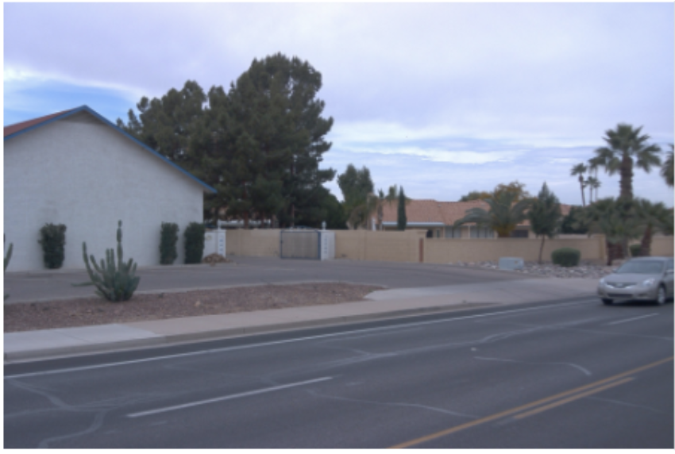
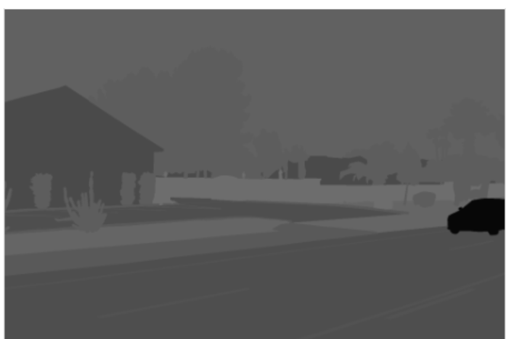
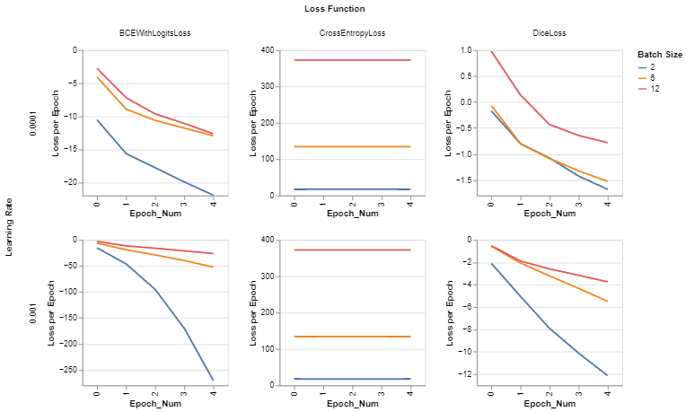
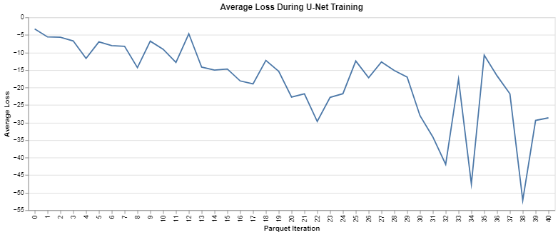

# U-Net Model Creation
This folder focuses on preprocessing and implementation of a U-Net model architecture focusing on targets seen in the WAYMO open data set, more correctly their Preception data. 
The goal is to segment 2D camera images and then relayer the segmentation results onto the original RGB image.
## Waymo Data
An example of segmenting the image provided by Waymo:

 

## Helper Scripts
Python scripts are utilized in the notebooks as helper functions for enabling a less bulky read.

For building the architecture of the model:
- build_unet.py
- unet_build_blocks.py

For preprocessing the data and some other helper functions
- helper.py
- transforms.py

## The Visualization 
Resulted from the unet_v2 notebook is an altair based visualization on Loss results from hyperparameter tuning. Results should be similar to:

## How the notebook operates
The primary focus of data gathering per the unet_v2 notebook is from the Google Cloud Storage, as a transfer of data between Waymo perception data buckets to personal buckets was necessary (considering the size of the training data alone is 1 TB large). An alternative for local use is involved, primarily in the case of example parquet files.

Loading data from the parquet files, the image data is transformed into input in PyTorch dataloaders for PyTorch implementation. Firstly, the notebook runs through hyperparameter tuning and then, towards the end, the final model is trained. 

The current model trained and operational in the Deployed Models folder is trained on 43 parquets of data out of the overall 1000. Our ideal model would be training on all 1000 parquets, but this is estimated to take about 166 hours (roughly 7 days). (This is assuming a base run of the lowest GPU offered with the Google Colab subscription without paying for extra compute units.) If a higher GPU were enabled, the time would be halved. 

## Model Edits versus a Baseline
What do we mean by this? I mean the changes we've made from a typical U-Net model to best fit our data needs.

One example is that we implement dynamic classes in our model training, as when working with the Waymo and other real world data, we don't have a set number of classes segmented per image. Also, their is a number of unidentified segmented results that causes the classes to be higher then normally anticipated per the Waymo documentation.
Another thing to note is that we enable packages and use methods that target low-memory use. For instance, we utilize mixed-precision training and the use of a cuda environment.

